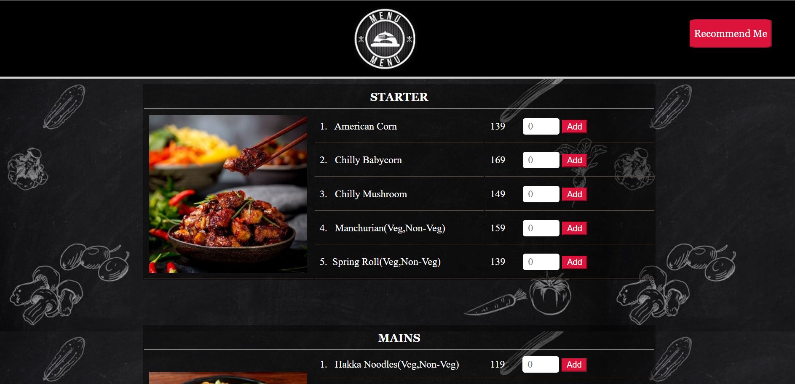
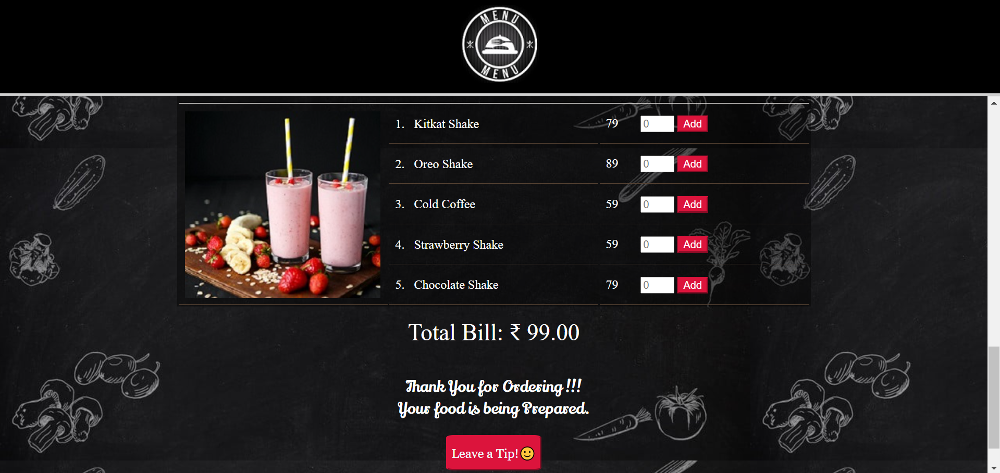
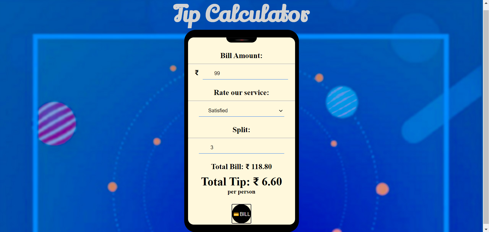

# food-ordering-with-restaurant-recommender-system
See Project : https://restaurant-with-recommender.herokuapp.com/

Developed a web application using HTML, CSS and JS to manage an online food ordering platform. Added a restaurant recommender model using flask and deployed the project on Heroku.
 
 

 

 

 

